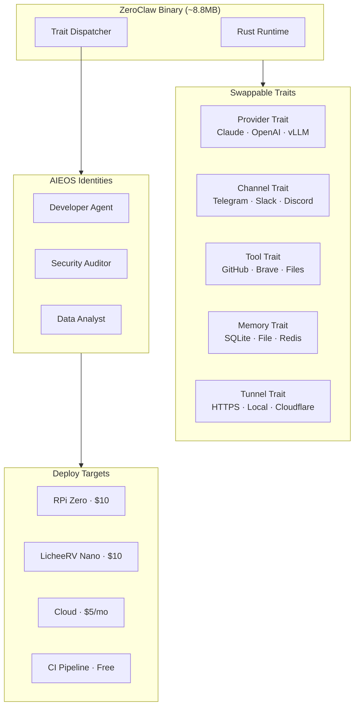

# 🦀 AI-Agent-ZeroClaw

<p align="center">
  
</p>

<p align="center">
  <a href="https://github.com/zeroclaw-labs/zeroclaw"></a>
  <a href="LICENSE"></a>
  <a href="https://ai-agent-zeroclaw.vercel.app"></a>
  
  
</p>

> **3.4 MB binary. <10ms boot.** Zero compromise agent runtime.

🌐 **[Live Website](https://ai-agent-zeroclaw.vercel.app)** · 📖 **[Docs](https://zeroclawlabs.ai)** · 🚀 **[Quick Start](#quick-start)**

---

## 🦀 Overview
**ZeroClaw** is the high-performance core of the ecosystem. Built in 100% Rust, it is a single-binary "Operating System for Agents". It abstracts models, memory, and tools into swappable traits, allowing for sub-10ms boot times and minimal RAM overhead.

### 🛡️ Mission Critical
ZeroClaw is designed for environments where reliability and speed are paramount:
- **Benchmarks**: [Performance Comparison](./benchmarks/vs-openclaw.md)
- **Advanced Config**: [Reliability & Estop Safety](./docs/advanced-config.md)

---

## 🏗️ Architecture



---

## 🛠️ Performance Skills
Rust-powered logic for deep system integration.

| Skill | Description | Status |
|-------|-------------|--------|
| `security-scanner` | Deep audit of 60+ repos: secret detection and compliance report cards. | 🛡️ New |
| `perf-benchmarker` | Sub-ms profiling that blocks deployments on performance regression. | ✅ Active |
| `data-validator` | Deterministic validation for high-integrity JSON/CSV datasets. | ✅ Active |
| `batch-processor` | Bulk ops: mass file rename, image optimization, rate-limited API calls. | ✅ Active |
| `edge-toolkit` | Cross-compile optimizers for RISC-V and ARM64. | ✅ Active |

---

## 👤 AIEOS Identities
Swappable, isolated personas for specialized tasks.

| Identity | Persona | Use Case |
|----------|---------|----------|
| `developer-agent.json` | Coding-focused | Feature implementation, code review, PR automation |
| `security-auditor.json` | CI/CD Gatekeeper | Vulnerability research and secret detection. |
| `privacy-guardian.json` | Local-only | An air-gapped, local-only persona for sensitive data. |
| `data-analyst.json` | Data processing | Optimized for pattern recognition and automated reporting. |

---

## 📊 Benchmarks

```
ZeroClaw vs OpenClaw (reproducible, macOS arm64):
━━━━━━━━━━━━━━━━━━━━━━━━━━━━━━━━━━━━━━━━━
Memory:   ZeroClaw  < 5MB    │ OpenClaw > 1000MB  │ 200× smaller
Boot:     ZeroClaw  < 10ms   │ OpenClaw > 500s    │ 3000× faster
Binary:   ZeroClaw  ~8.8MB   │ OpenClaw ~28MB     │ 3× smaller
Hardware: ZeroClaw  $10 SBC  │ OpenClaw Mac Mini  │ 59× cheaper
━━━━━━━━━━━━━━━━━━━━━━━━━━━━━━━━━━━━━━━━━
Measured with /usr/bin/time -l on release builds
```

---

## 📁 Repository Structure

```text
AI-Agent-ZeroClaw/
├── identity/                   # AIEOS persona definitions
│   ├── developer-agent.json
│   ├── security-auditor.json
│   ├── privacy-guardian.json  # Air-gapped identity
│   └── data-analyst.json
├── assets/                    # Project branding
├── benchmarks/                # Performance measurement tools
│   ├── reasoning_bench.rs     # Rust reasoning speed harness
│   ├── vs-openclaw.md
│   └── vs-picoclaw.md
├── docs/                      # Technical & Safety guides
│   └── advanced-config.md     # Estop & Reliability configuration
├── skills/                    # Rust crates for agent logic
│   ├── security-scanner/      # Deep auditing toolkit
│   ├── perf-benchmarker/
│   ├── data-validator/
│   ├── batch-processor/
│   └── edge-toolkit/
├── workflows/                 # CI/CD & Production pipelines
│   ├── ci-security-gate.md
│   ├── aieos-migration.md
│   ├── edge-deployment.md
│   └── batch-validation.md
├── use-cases/                 # Deployment examples
│   ├── privacy-agent/         # Air-gapped setup guide
│   ├── ci-security-bot/
│   └── batch-data-processor/
├── website/                   # Next.js Site
└── assets/                    # Assets
```

---

## ⚡ Quick Start

```bash
# Install (pre-built binary)
curl -fsSL https://zeroclawlabs.ai/install.sh | sh

# Or build from source
git clone https://github.com/zeroclaw-labs/zeroclaw.git
cd zeroclaw
cargo build --release

# Run
./target/release/zeroclaw --identity identity/security-auditor.json
```

---

## 🗺️ Roadmap

- [x] Trait-driven architecture
- [x] AIEOS identity system
- [x] Sub-10ms cold start
- [x] RISC-V / ARM64 / x86_64 targets
- [ ] WASM compilation target
- [ ] Distributed task execution
- [ ] ZeroClaw → NanoClaw swarm integration
- [ ] Hardware-in-the-loop CI testing

---

## 🦀 Part of the Claw Ecosystem
| Repo | Focus |
|------|-------|
| [AI-Agent-OpenClaw](https://github.com/mk-knight23/AI-Agent-OpenClaw) | 🦞 Full-stack Hub |
| [AI-Agent-Nanobot](https://github.com/mk-knight23/AI-Agent-Nanobot) | 🐈 Lightweight Lab |
| [AI-Agent-ZeroClaw](https://github.com/mk-knight23/AI-Agent-ZeroClaw) | 🦀 Rust Runtime · **← You are here** |
| [AI-Agent-PicoClaw](https://github.com/mk-knight23/AI-Agent-PicoClaw) | 🦐 Edge/IoT |
| [AI-Agent-NanoClaw](https://github.com/mk-knight23/AI-Agent-NanoClaw) | 🐚 Swarm Agent |

*Part of the Claw Ecosystem by [mk-knight23](https://github.com/mk-knight23)*

---

## ⚖️ License
MIT OR Apache-2.0 © [mk-knight23](https://github.com/mk-knight23)
